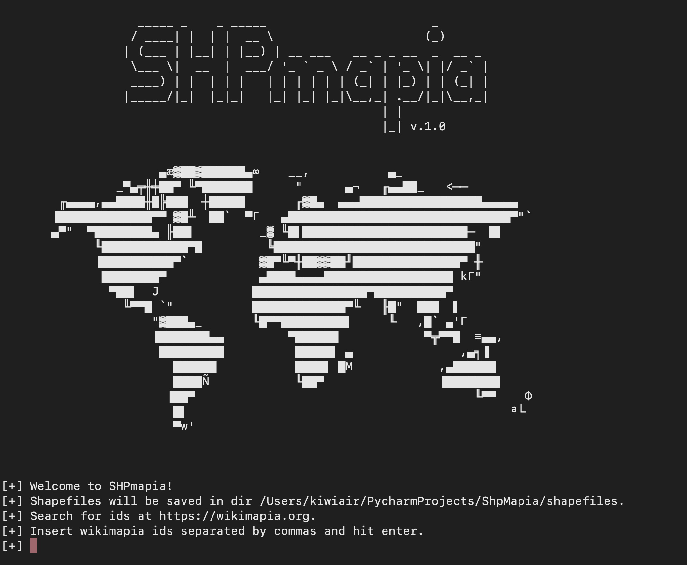

# ShapeMapia

This simple command line tool allows you to extract json data from wikimapia.org and converts it to shapefile ready for gis software usage.

## Installing

```bash
pip install -r requirements.txt
```

## Running

```bash
python3 shpmapia.py
```
## Screenshot


